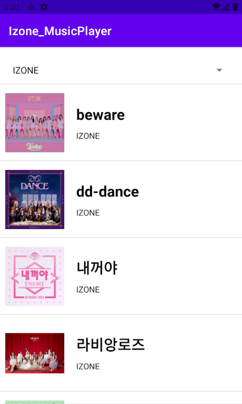
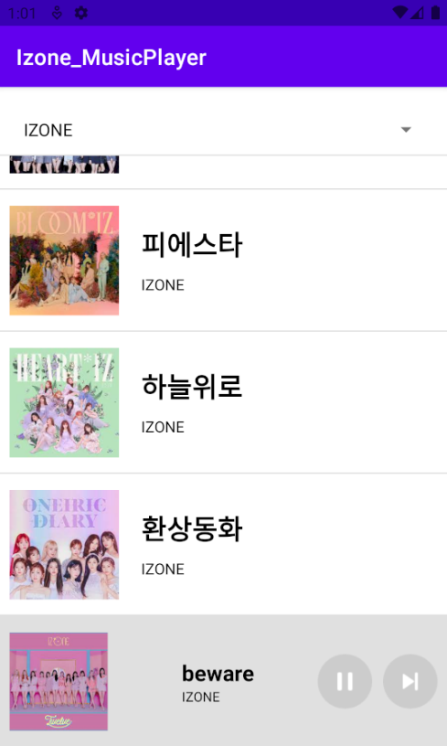
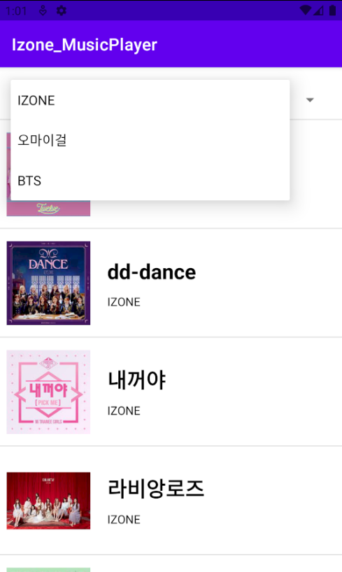
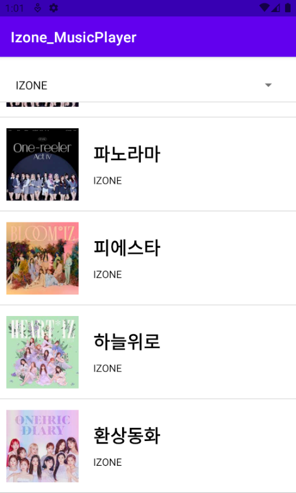
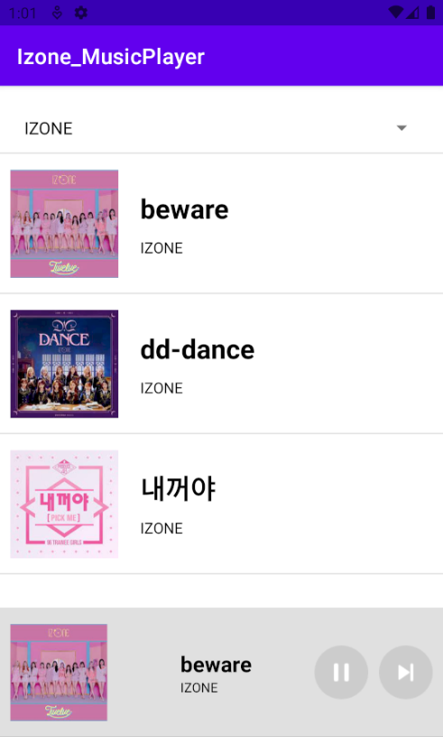
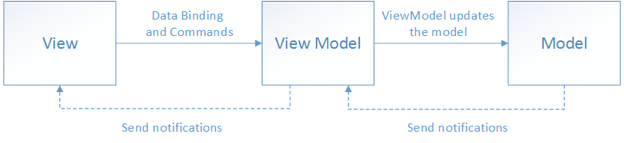
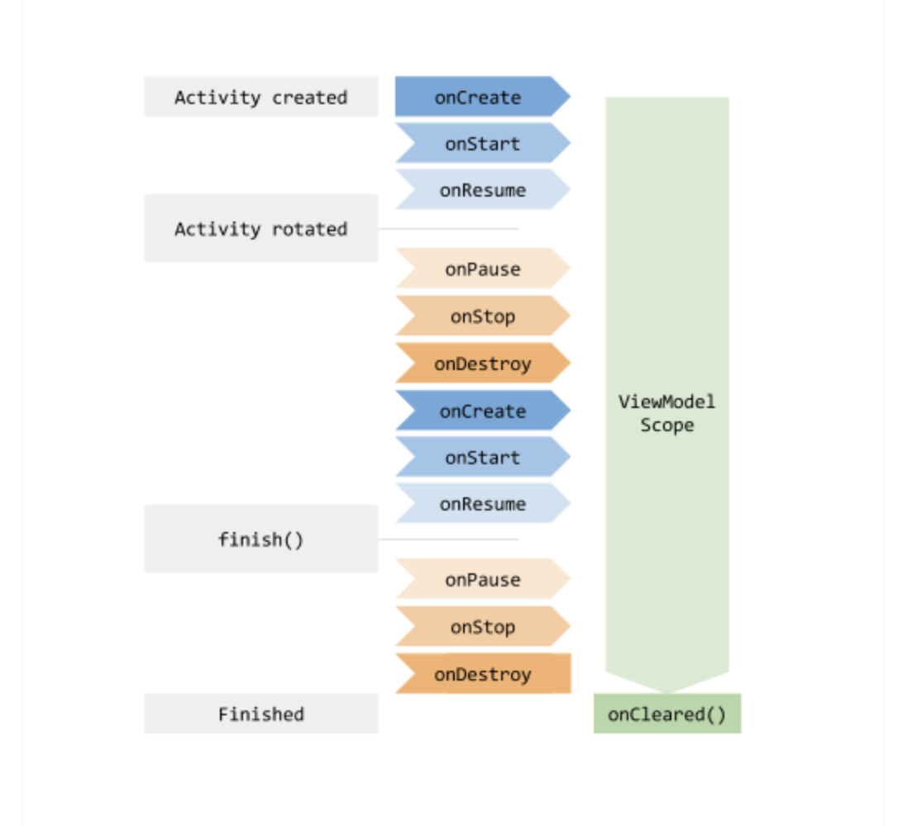

# Toy Project - MiniPlayer
 _MVVM 구조 이해 및 안드로이드 jetpack활용을 위한 개인 프로젝트_
<br><br>

## 목차

프로젝트 
1. [Miniplayer - MiniPlayer](#MiniPlayer---MiniPlayer)
2. [Miniplayer - 구조도](#MiniPlayer---구조도)
3. [Miniplayer - 기능](#MiniPlayer---기능)

<br>

기술 
1. [MVVM](#MVVM)
2. [Kotlin](#Kotlin)
3. [Retrofit](#Retrofit)
4. RecyclerView
5. LiveData
<br>

# 프로젝트

## MiniPlayer - MiniPlayer
본 프로젝트는 처음으로 Kotlin을 이용하여 만든 Android app이며 구글에서 밀고 있는 Jetpack 라이브러리를 활용해보기위한 경험과 앱의 유지보수성을 높이기 위한 아키텍처 패턴인 MVVM을 적용하기 위한 프로젝트이다. 학습의 목적으로 다양한 기술들의 경험과 현재 유행하는 아키텍처 패턴을 경험함으로써 신기술에 대응하고 길게 사용할 수 있는 앱을 만드는 것을 목적으로 한다.

<br>
DataSet : 구글링 및 구매 <br>
Tool & FrameWork : Android Studio, Firebase Console <br>
Technology : Kotlin, MVVM, Retrofit, RecyclerView, DataBinding, LiveData, Glide
<br><br>

## MiniPlayer - 구조도
다음은 제작한 프로젝트의 구조도이며, MVVM구조를 이해하기 위해 그린 그림이다. 
<br>
### Network


<br>

### Spinner


<br>

### RecyclerView


<br>

### Fragment


<br><br>

## MiniPlayer - 기능
다음은 music player의 기능이다.
<br><br>

### Music List 

 |
--- | --- | 

앱 초기화면으로 음악 리스트가 나열된다.

<br><br>

### Spinner 

 |
--- | --- | 

spinner 선택시 음악 list가 바뀐다.

<br><br>

### 하단 플레이어



하단 플레이어로 album image, title, singer와 음악 멈춤 및 다음 노래 기능이 존재한다.<br>
<br><br>

### 추가 기능
- 모든 음악은 끝나면 다음 노래로 자동으로 넘어간다. -> coroutine을 통해 mediaplayer의 state를 들어 노래가 끝나면 자동으로 다음 노래로 넘긴다.
- 마지막 음악에서 다음 노래로 넘어가는 경우 첫 음악으로 돌아간다.
- 음악을 듣다가 spinner로 가수 목록을 변경해도 전 가수의 노래list가 loop된다. 
<br><br><br>

# 기술

## MVVM
Model, View, ViewModel로 구성된 안드로이드 아키텍쳐 패턴이다. <br><br>
View : 사용자에게 보여주는 UI부분을 담당 <br>
ViewModel : View에서 사용하는 data처리 및 관리 <br>
Model : DB저장소 접근 데이터 틀 <br>

### MVVM특징
- view와 viewmodel은 1:m 관계로 적용이 가능하다.
- 재사용성이 용이하다.
- 효과적인 역할 분담과 테스트 용이성이 증가한다.

<br>

## AAC ViewModel vs MVVM ViewModel
많은 사람들이 착각하는 것이 AAC ViewModel과 MVVM ViewModel이 같다고 생각하는 것이다. <br>
그러나, AAC의 ViewModel과 MVVM ViewModel은 전혀 다르다. <br>

### MVVM ViewModel
MVVM에서의 ViewModel역할은 View와 Model사이의 데이터를 관리하는 역할이다. <br>
MVVM에서의 View는 화면에 표현되는 레이아웃을 관리하는 역할을 하며, ViewModel은 View와 연결한 데이터와 명령을 구성하고 이에 대한 변경을 View에게 알려주는 역할을 한다. <br>

<br>
결국, ViewModel은 Model은 알지만 View는 모르고, View는 ViewModel은 알지만 Model은 모르고 있다. <br>
이런 코드는 결국 서로간의 의존 형태를 지속하기 때문에 Microsoft에서는 DataBinding을 필수로 두고 있다. <br>
DataBinding은 View와 ViewModel간의 데이터와 명령을 연결해주는 매개체로 서로의 존재를 모르더라도 상호작용을 도와주는 역할을 하고 있다. 
이런 매개체 역할이 의존성을 낮추게 도와주고 있다.
<br>

### AAC ViewModel
AAC ViewModel은 구글에서 만들었으며, 앱의 configuration에 대응하여 View의 데이터를 보관하고 있고 View의 lifecycle을 알고 있다. <br>
즉, MVVM ViewModel과 달리 목적이 앱의 configuration에 대응하기 위한 목적을 띄고있다. <br>
그렇다면? AAC ViewModel로 MVVM ViewModel을 만들어낼 수 없을까? 답은 "가능하다"이다. <br>
실제로 많은 블로그에서 예시로 AAC ViewModel을 이용해 MVVM패턴을 만들어내고 있다.  <br>
오히려 AAC ViewModel을 통해 만들게 되면, configuration에 대응도 되고 view의 라이프사이클에 맞추어 데이터 관리 기능도 추가가되는 좋은 효과를 불러올 수 있다. <br>

<br><br>
하지만! 위에서 언급했듯이 MVVM패턴에서 View와 ViewModel은 1:m의 관계를 가지고 있다. 즉, 여러개의 ViewModel이 나올 수 있다. <br>
그러나, AAC의 ViewModel은 실제로 Activity에 싱글톤으로 생성되어 1:1관계만을 가질 수 밖에 없게 된다. <br>
결국, MVVM ViewModel에 AAC ViewModel을 적용할 수 있으나 View와 ViewModel이 1:1의 관계만을 갖게되며, 이는 Microsoft에서 제시한 MVVM 패턴의 목적과 맞지 않다고 볼 수 있다.
<br>

## Kotlin
- 정적 타입 언어이면서 자료형 추론이 가능하다.
- 코틀린 컴파일러가 컴파일시 자바 바이트 코드를 생성한다. = 자바와 호환성이 좋다.
- NPE(Null Pointer Error)방지가 가능하다. = 프로그램 안정성이 좋다.
- 불변 변수와 가변 변수를 지원한다. <br>
  ex) val(Immutable) : 할당 후 변경 불가 <br>
        var(Mutable) : 할당 후 변경 가능 <br>
- 코드가 간결해진다. = 코드의 직관성↑
- 확장함수를 이용할 수 있다. = 프로그래밍 용이, 그러나 많이 사용시 가독성↓
- 함수형 프로그래밍이다. = 함수의 유기적인 연결로 프로그래밍한다.      
 
<br>

### Data Class
data class는 getter와 setter를 제공해주며 또한, 일반 클래스와 다르게 equals(), hashCode(), toString(), copy() 등을 제공해주고 있다. <br>
많은 사람들이 헷갈려하고 있는 것이 일반 클래스에는 getter와 setter가 없다고 생각하는데 실제로 디컴파일해보면 getter와 setter메소드를 제공해주는 것을 확인할 수 있다. <br>
그렇다면 data class는 왜 사용하는 것일까? 위에서 언급했듯이 equals와 hashcode 그리고 copy를 활용할 수 있기 때문에 해당 메소드들을 필요로 한다면 그 상황에 맞추어 사용하는 것이 좋다고 생각한다. <br>

### Scope Function
범위 지정 함수는 특정 객체에 있는 함수를 연속해서 사용하거나 함수로 전달하기 위해 사용하는 함수이다. <br>
총 6가지로써 사용이 가능하다.

#### let
let은 호출했던 객체를 다음 블럭의 인자로 전달하고 그 블록 함수의 결과를 반환한다. <br>
또한, 불필요한 변수 선언을 방지해주는 역할을 해준다. (변수의 범위를 제한, null이 아닌 코드를 실행하는 경우) <br>

```
getItem().let { item ->
 // select의 파라미터를 이 블록으로 제한
 shop.select(item)
} 

// message객체를 null이 아닌 경우에 
message?.let {
 Toast.makeText(this, it, Toast.LENGTH_SHORT).show()
}
```

#### also
also는 수신 객체를 전혀 사용하지 않거나 속성을 변경하지 않는 경우에 사용된다. <br>
또한, 수신 객체를 반환하고 있기 때문에 자기자신이 필요한 초기화에서도 사용된다. <br>

```
message.also { //message객체를 변화하지않고 사용
 isMessage(it)
 print(it)
}
```

#### run
run은 익명함수의 형태와 객체에서 호출하는 형태를 제공하고 있다. 또한, block안의 함수들을 호출하고 그 결과를 반환환다.

```
val sum = run {
 val a = 10
 val b = 20
 
 a + b
}
```

<br>

또한, run은 안전한 호출이 가능하여 null일 수 있는 객체의 속성이나 함수의 연속적 접근이 매우 유용하다.

```
saveInstanceState?.run {
 val test1 = getInt("test1")
 val test2 = getString("test2")
 
 //...
}
```

#### with
인자로 받은 객체를 블록의 리시버로 전달한다. <br>
안전한 호출이 안되기 때문에 널 값이 아니어야만 사용이 가능하고 결과가 필요 없을 때 사용한다.

```
val testCode: Test = getTest()
with(testCode) {
 // test1과 test2는 TEST객체의 멤버변수
 print(test1)
 print(test2)
}
```

#### apply
apply함수는 호출한 객체를 바로 다음 블럭 리시버로 전달한다. <br>
내부에서 수신 객체의 함수를 사용하지 않고 자기 자신을 다시 반환하려고 할 때 사용한다.

```
// 대표 예제 - 객체 초기화
val person = Person().apply {
 name = "choi"
 age = 26
}
```

#### Scope Function 케이스별 선택
- Null이 아닌 객체에서 람다함수 실행 : **let**
- 로컬 범위에서 변수로 표현식 소개 : **let**
- 객체 구성 : **apply**
- 객체 구성 및 결과 계산 : **run**
- 식이 필요한 실행 문 : non-extension **run**
- 추가 효과 : **also**
- 객체에 대한 그룹화 함수 호출 : **with**

출처 : [코틀린 scope function 비교 및 상황별 함수 선택](https://ykkdev.tistory.com/4)

## Retrofit
서버로부터 데이터를 받아오는 작업으로 Networking 기능을 쉽게 사용하는 라이브러리이다.

### Retrofit을 왜 사용하는가
예전에는 Okhttp라이브러리와 AsyncTask를 통해 구현하였느나, AsyncTask가 deprecated되어 사용할 수 없게 된다. <br>
_* 여담으로 AsyncTask는 context누수나 Callback을 놓치는 다양한 오류가 발생되어 API30에서부터 deprecate되었다._ <br><br>

Retrofit은 AsyncTask대신 Callback을 이용하여 Network연결을 도와주었다. <br>
따라서, Network 연결 부분을 자동으로 관리해주는 retrofit이 Android App에서 자주 사용되고 있다.<br>
또한, retrofit은 성능상으로도 AsyncTask를 사용한 것보다 3~10배 가량 더 좋다. <br>

## RecyclerView
RecyclerView는 대량의 데이터셋을 효율적으로 표시하기 위해 사용한다. 개발자가 각 항목의 모양을 정해주면 RecyclerView는 해당 요소를 동적으로 생성한다. <br>
또한, RecyclerView는 이름에서 알 수 있듯이 개별 요소들을 재활용한다. 항목이 벗어나더라도 뷰를 제거하지 않고 뷰를 재사용하여 데이터만 바꾸어주고 있다. <br>
뷰를 재사용함으로써 앱의 response속도와 앱의 전력 소모를 개선할 수 있다. 

### RecyclerView 주요 클래스
RecyclerView는 데이터에 해당하는 View가 포함되어 있는 ViewGroup이다. <br>
목록의 각 개별 요소는 ViewHolder객체로 정의되며, 처음에는 연결된 데이터가 없지만, RecyclerView가 ViewHolder가 생성된 후 View의 데이터를 ViewHolder에 바인딩한다. <br>
즉, RecyclerView는 View를 요청한 다음 어댑터에서 메소드를 호출하여 View를 View의 데이터에 바인딩하고 있다. <br>
LayoutManager는 목록의 모양을 결정한다.
- LinearLayoutmanager : 항목을 1차원 목록으로 정렬
- GridLayoutManager : 항목을 2차원 그리드로 정렬
- StaggeredGridLayoutManager : GridLayoutManager와 비슷하나 너비와 높이를 맞추지 않고 어긋나있을 수 있다.

### 어댑터 및 뷰 홀더 구현
LayoutManager로 레이아웃을 정했으면 Adapter 및 ViewHolder를 구현해야한다. <br>
ViewHolder는 목록에 있는 개별 항목의 Layout을 포함하는 View의 래퍼이다. Adapter는 필요에 따라 ViewHolder 객체를 만들고 이러한 뷰에 데이터를 설정한다. (이를 바인딩이라고 한다.)<br>
어댑터를 정의할 때 3가지 메소드를 정의한다.
- onCreateViewHolder() : RecyclerView에서 ViewHolder를 새로 만들어야 할 때마다 이 메소드를 호출한다. ViewHolder와 연결된 View를 생성하고 초기화하지만 아직 컨텐츠는 채우지 않는다.
- onBindViewHolder() : RecyclerView에서 ViewHolder를 데이터와 연결할 때 호출한다.
- getItemCount() : RecyclerView가 데이터 셋 크기를 가져올 때 호출한다.(이 항목을 이용하여 추가로 표시할게 있는지 확인한다.)

### 실제 호출 확인

실제 RecyclerView에서 getItemCount()로 목록의 개수를 확인하고 onCreateViewHolder() View를 생성한뒤 onBindViewHolder()로 데이터를 View에 연결해주고 있었다.

## LiveData


<br><br><br>
_Contact me :_ &nbsp; 
[](mailto:hschoi5542@gmail.com)

<br>
<br>
<br>

[](https://hits.seeyoufarm.com)
