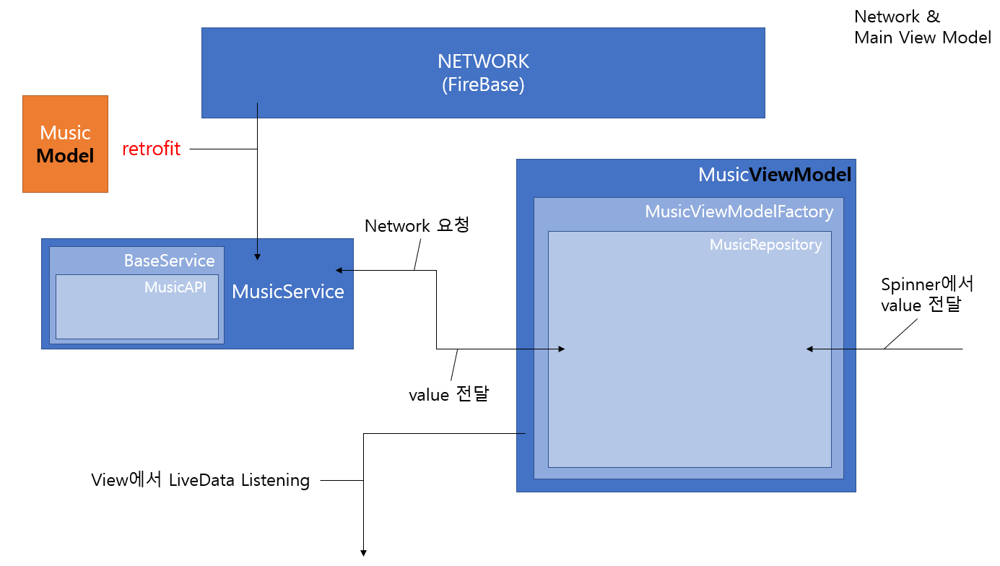
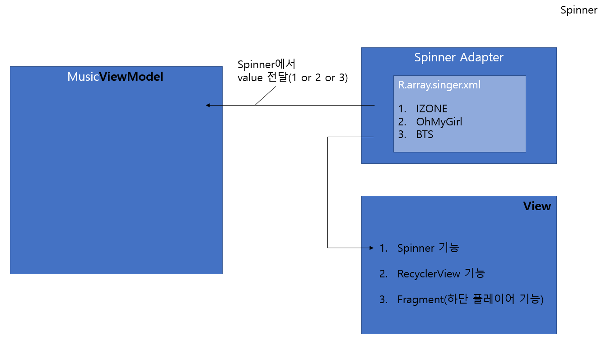
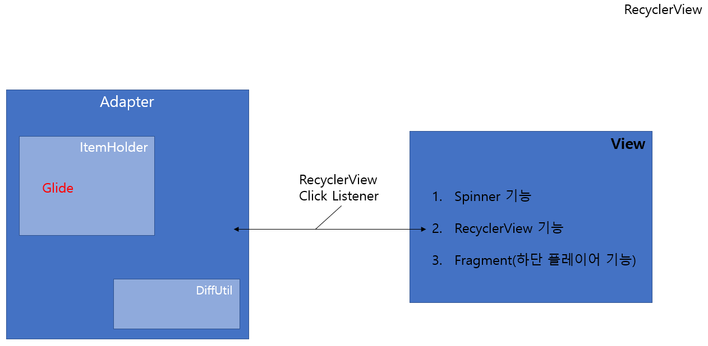
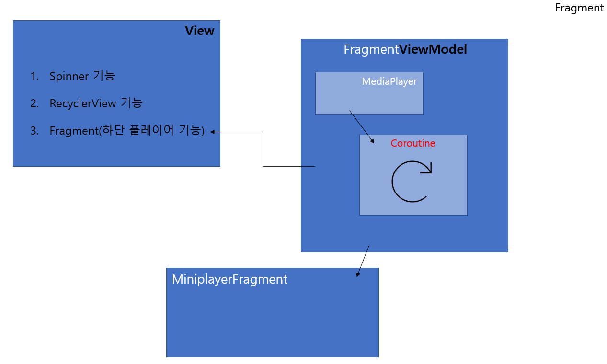
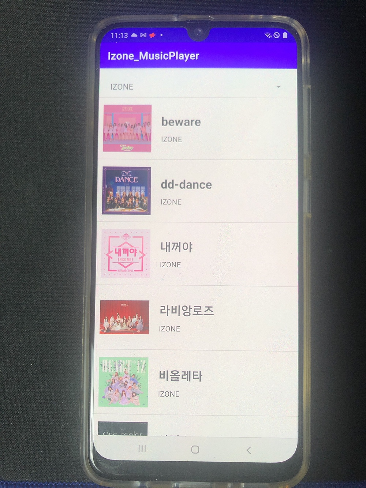
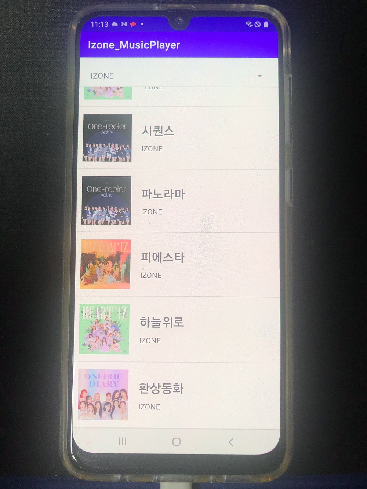
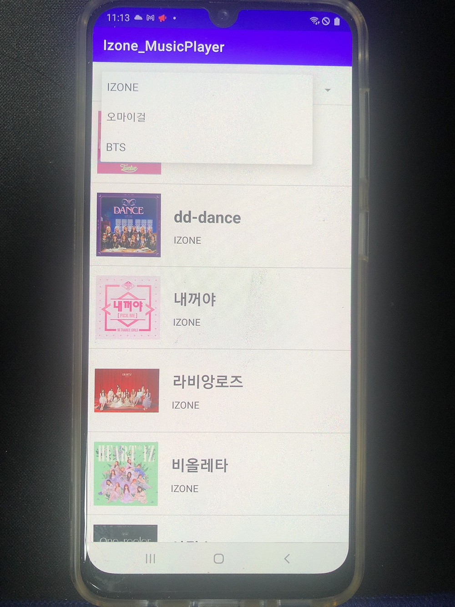
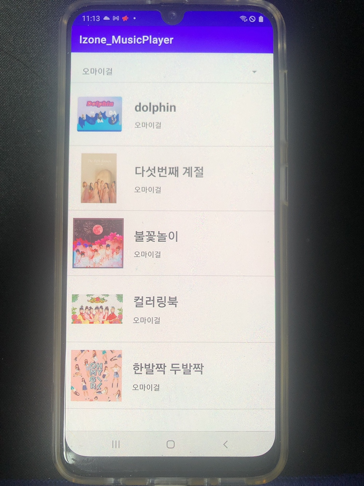
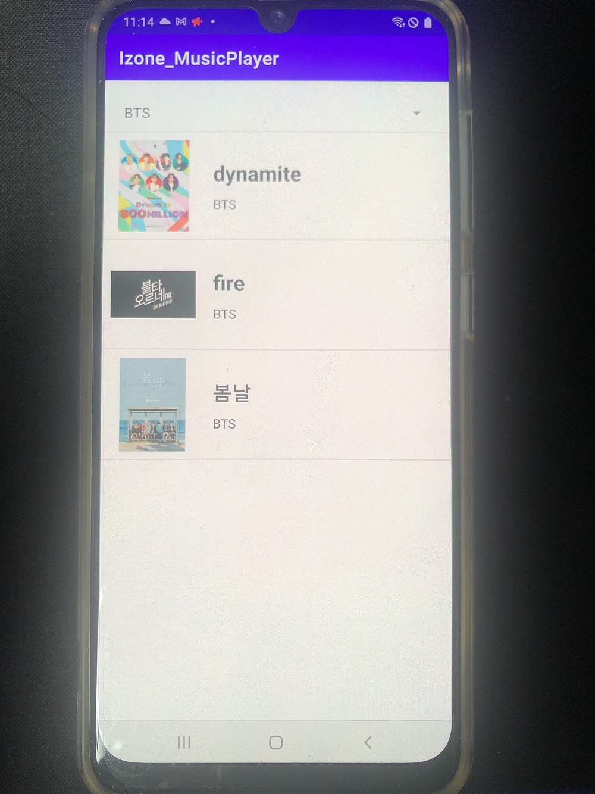
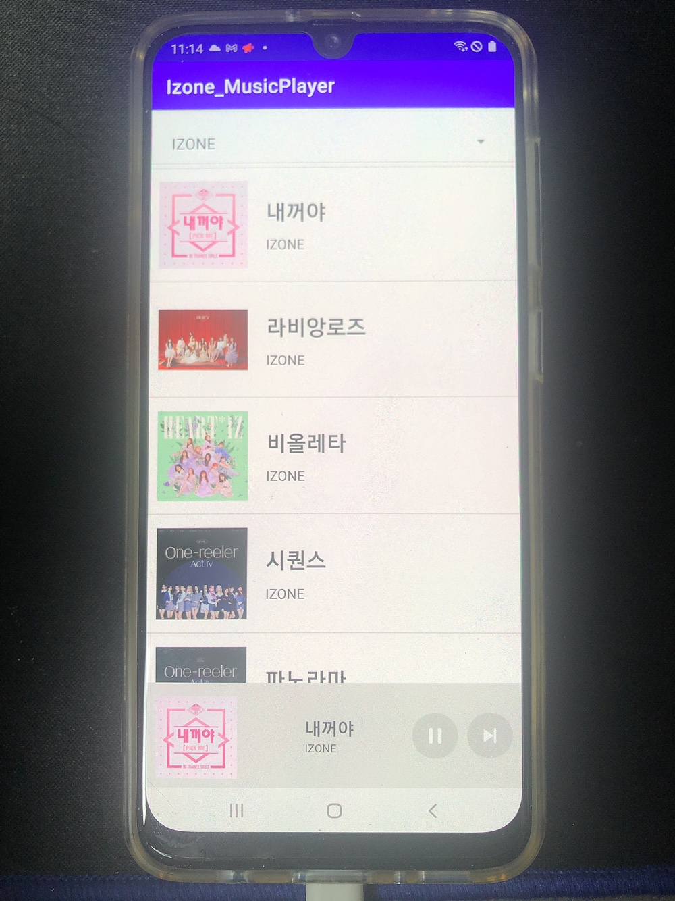

# Toy Project - MiniPlayer
 _MVVM 구조 이해를 위한 개인 프로젝트_
  

## 목차
기술 
1. [MVVM](#MVVM)
2. [Kotlin](#Kotlin)
3. [Retrofit](#Retrofit)
4. [Coroutine](#Coroutine)

 

프로젝트 
1. [Miniplayer - MiniPlayer](#MiniPlayer---MiniPlayer)
2. [Miniplayer - 구조도](#MiniPlayer---구조도)
3. [Miniplayer - 기능](#MiniPlayer---기능)

 

# 기술

## MVVM
Model, View, ViewModel로 구성된 안드로이드 아키텍쳐 패턴이다. MVC와 MVP의 의존성 및 유지보수성을 개선하기 위해 등장하였다.  
View : 사용자에게 보여주는 UI부분을 담당  
ViewModel : View에서 사용하는 data처리 및 관리  
Model : DB저장소 접근 데이터 틀  

### MVVM특징
- view와 viewmodel은 n:m 관계로 적용이 가능하다.
- 재사용성이 용이하다.
- 효과적인 역할 분담과 테스트 용이성이 증가한다.

 

## Kotlin
- 정적 타입 언어이면서 자료형 추론이 가능하다.
- 코틀린 컴파일러가 컴파일시 자바 바이트 코드를 생성한다. = 자바와 호환성이 좋다.
- NPE(Null Pointer Error)방지가 가능하다. = 프로그램 안정성이 좋다.
- 불변 변수와 가변 변수를 지원한다.  
  ex) val(Immutable) : 할당 후 변경 불가  
        var(Mutable) : 할당 후 변경 가능  
- 코드가 간결해진다. = 코드의 직관성↑
- 확장함수를 이용할 수 있다. = 프로그래밍 용이, 그러나 많이 사용시 가독성↓
- 함수형 프로그래밍이다. = 함수의 유기적인 연결로 프로그래밍한다.      
 
 

## Retrofit
서버로부터 데이터를 받아오는 작업으로 Networking 기능을 쉽게 사용하는 라이브러리이다.

### Retrofit을 왜 사용하는가
예전에는 Okhttp라이브러리와 AsyncTask를 통해 구현하였느나, AsyncTask가 deprecated되어 사용할 수 없게 된다.  
또한, retrofit은 성능상으로도 retrofit이 AsyncTask보다 3~10배 가량 더 좋다.  
Retrofit은 Callback과 Okhttp를 이용한 라이브러리이다.

 

## Coroutine
동시성 프로그래밍으로 context Switching시 overhead가 작은 일종의 경량 스레드이다. (스레드 안의 작업의 단위)

### 동기 vs 비동기
동기 : 요청을 보낸후 반환값을 얻기 전까지 대기한다. = Synchronous  
비동기 : 요청을 보내고 대기시간동안 다른 일을 수행한다. = Asynchronous , Coroutine은 비동기

 

### blocking vs Non-blocking
blocking : 요청한 작업을 마칠 때까지 계속 대기하는 작업. return 값을 받을 때까지 진행한다.  
Non-blocking : 요청한 작업을 즉시 마칠 수 없다면 return하는 작업 
 
* 동기 비동기와의 차이점은 blocking/Non-blocking은 return을 언제하느냐의 관심사이고, 동기/비동기는 작업 완료 여부를 누가 보는지가 관심사이다. (작업 완료를 신경쓰지 않는다면 비동기)
* 비슷한 개념으로 착각했었는데 면접관님께서 지적해주셨습니다. 감사합니다.

 

### Thread vs Coroutine
Thread : 자체적인 Stack 메모리를 가지며 JVM Stack 영역에 적재된다.  
단위 = Thread  
Coroutine : 다수의 작업에 Object를 할당하며, JVM Heap 영역에 적재된다. Context Switching시점을 개발자가 정한다.  
단위 = Object  

=> 코루틴은 스레드를 잘게 잘라 사용하는 개념이다.

   

# 프로젝트

## MiniPlayer - MiniPlayer
본 프로젝트는 Kotlin과 MVVM구조, retrofit, RecyclerView 등 다양한 안드로이드 기술들을 이해하기 위해 진행한 프로젝트입니다. 

 
DataSet : 구글링 및 구매  
Tool & FrameWork : Android Studio, Firebase Console  
Technology : Kotlin, MVVM, Retrofit, RecyclerView, DataBinding, LiveData, Glide
  

## MiniPlayer - 구조도
다음은 제작한 프로젝트의 구조도이며, MVVM구조를 이해하기 위해 그린 그림이다. 
 
### Network

 

### Spinner

 

### RecyclerView

 

### Fragment

  

## MiniPlayer - 기능
다음은 music player의 기능이다.
  
### Music List 

앱 초기화면으로 음악 리스트가 나열된다. 
 

Scrolling 가능 
  
### Spinner 

spinner 선택시 음악 list가 바뀐다. 
 

 

다음은 리스트가 변경된 모습이다. 
  
### 하단 플레이어

하단 플레이어로 album image, title, singer와 음악 멈춤 및 다음 노래 기능이 존재한다. 
  

### 추가 기능
- 모든 음악은 끝나면 다음 노래로 자동으로 넘어간다. -> coroutine을 통해 mediaplayer의 state를 들어 노래가 끝나면 자동으로 다음 노래로 넘긴다.
- 마지막 음악에서 다음 노래로 넘어가는 경우 첫 음악으로 돌아간다.
- 음악을 듣다가 spinner로 가수 목록을 변경해도 전 가수의 노래list가 loop된다. 
   
_Contact me :_ &nbsp; 

 
 
 

